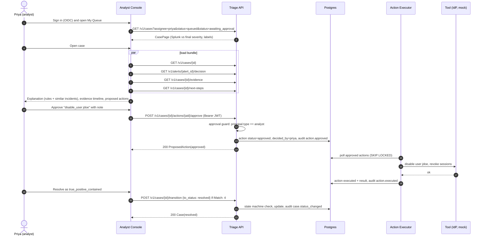

# Sequence: analyst console triage journey

```mermaid
sequenceDiagram
  autonumber
  actor P as Priya (analyst)
  participant UI as Analyst Console
  participant API as Triage API
  participant DB as Postgres
  participant X as Action Executor
  participant T as Tool (IdP, mock)
  P->>UI: Sign in (OIDC) and open My Queue
  UI->>API: GET /v1/cases?assignee=priya&status=queued&status=awaiting_approval
  API-->>UI: CasePage (Splunk vs final severity, labels)
  P->>UI: Open case
  par load bundle
    UI->>API: GET /v1/cases/{id}
    UI->>API: GET /v1/alerts/{alert_id}/decision
    UI->>API: GET /v1/cases/{id}/evidence
    UI->>API: GET /v1/cases/{id}/next-steps
  end
  UI-->>P: Explanation (rules + similar incidents), evidence timeline, proposed actions
  P->>UI: Approve "disable_user jdoe" with note
  UI->>API: POST /v1/cases/{id}/actions/{aid}/approve (Bearer JWT)
  API->>API: approval guard: principal.type == analyst
  API->>DB: action status=approved, decided_by=priya, audit action.approved
  API-->>UI: 200 ProposedAction(approved)
  X->>DB: poll approved actions (SKIP LOCKED)
  X->>T: disable user jdoe, revoke sessions
  T-->>X: ok
  X->>DB: action executed + result, audit action.executed
  P->>UI: Resolve as true_positive_contained
  UI->>API: POST /v1/cases/{id}/transition {to_status: resolved} If-Match: 4
  API->>DB: state machine check, update, audit case.status_changed
  API-->>UI: 200 Case(resolved)
```
