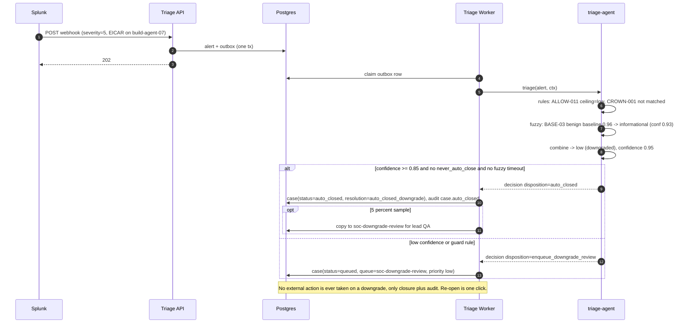

# Sequence: downgrade → auto-handle with audit

```mermaid
sequenceDiagram
  autonumber
  participant S as Splunk
  participant API as Triage API
  participant DB as Postgres
  participant W as Triage Worker
  participant A as triage-agent
  S->>API: POST webhook (severity=5, EICAR on build-agent-07)
  API->>DB: alert + outbox (one tx)
  API-->>S: 202
  W->>DB: claim outbox row
  W->>A: triage(alert, ctx)
  A->>A: rules: ALLOW-011 ceiling=low, CROWN-001 not matched
  A->>A: fuzzy: BASE-03 benign baseline 0.96 -> informational (conf 0.93)
  A->>A: combine -> low (downgraded), confidence 0.95
  alt confidence >= 0.85 and no never_auto_close and no fuzzy timeout
    A-->>W: decision disposition=auto_closed
    W->>DB: case(status=auto_closed, resolution=auto_closed_downgrade), audit case.auto_closed
    opt 5 percent sample
      W->>DB: copy to soc-downgrade-review for lead QA
    end
  else low confidence or guard rule
    A-->>W: decision disposition=enqueue_downgrade_review
    W->>DB: case(status=queued, queue=soc-downgrade-review, priority low)
  end
  Note over W,DB: No external action is ever taken on a downgrade, only closure plus audit. Re-open is one click.
```
