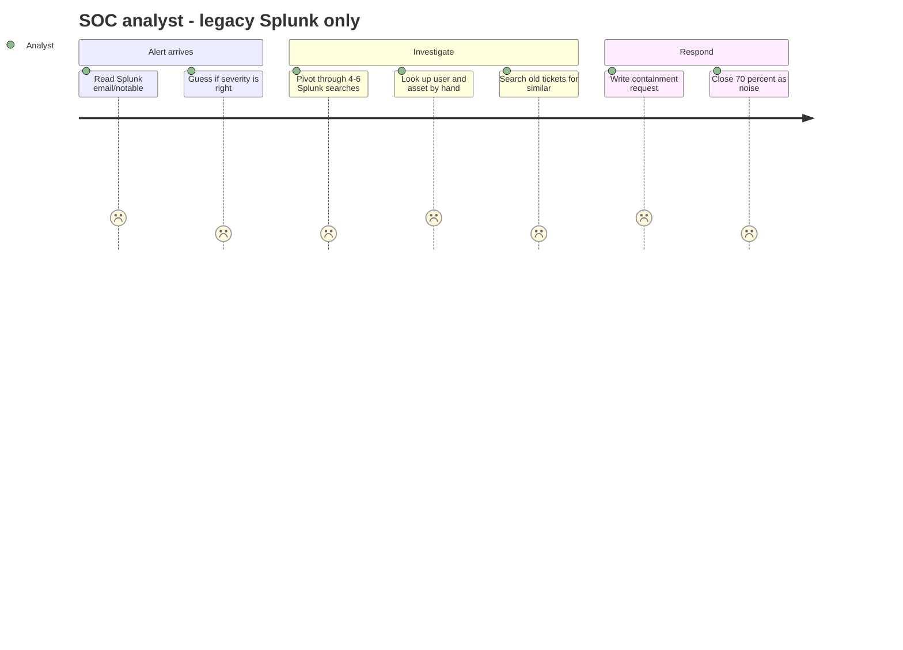
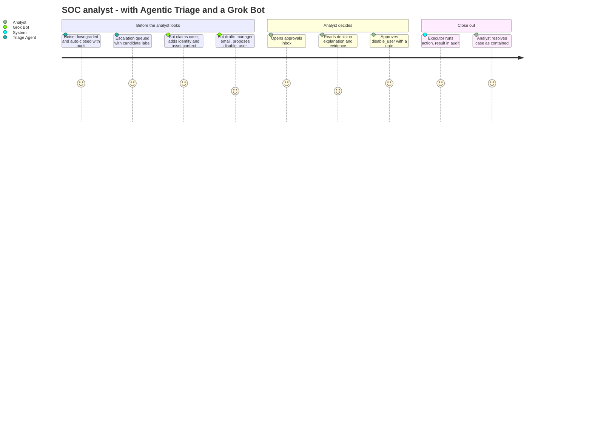
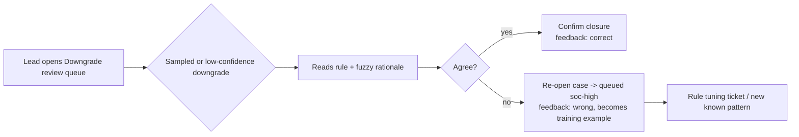
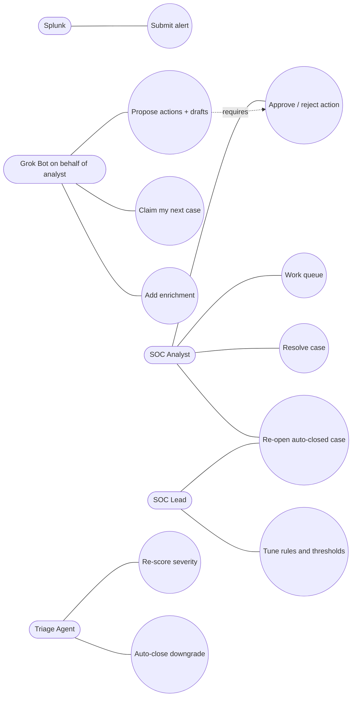

# User journeys

## Analyst day: before (Splunk only) vs after (Agentic Triage + Grok Bot)

```mermaid
journey
  title SOC analyst - legacy Splunk only
  section Alert arrives
    Read Splunk email/notable: 2: Analyst
    Guess if severity is right: 1: Analyst
  section Investigate
    Pivot through 4-6 Splunk searches: 1: Analyst
    Look up user and asset by hand: 2: Analyst
    Search old tickets for similar: 1: Analyst
  section Respond
    Write containment request: 2: Analyst
    Close 70 percent as noise: 1: Analyst
```

```mermaid
journey
  title SOC analyst - with Agentic Triage and a Grok Bot
  section Before the analyst looks
    Noise downgraded and auto-closed with audit: 5: Triage Agent
    Escalation queued with candidate label: 5: Triage Agent
    Bot claims case, adds identity and asset context: 5: Grok Bot
    Bot drafts manager email, proposes disable_user: 4: Grok Bot
  section Analyst decides
    Opens approvals inbox: 5: Analyst
    Reads decision explanation and evidence: 4: Analyst
    Approves disable_user with a note: 5: Analyst
  section Close out
    Executor runs action, result in audit: 5: System
    Analyst resolves case as contained: 5: Analyst
```

## Journey: SOC Lead reviews auto-closed downgrades

```mermaid
flowchart LR
  A[Lead opens Downgrade review queue] --> B{Sampled or low-confidence downgrade}
  B --> C[Reads rule + fuzzy rationale]
  C --> D{Agree?}
  D -->|yes| E[Confirm closure<br/>feedback: correct]
  D -->|no| F[Re-open case -> queued soc-high<br/>feedback: wrong, becomes training example]
  F --> G[Rule tuning ticket / new known pattern]
```

## Use cases

```mermaid
flowchart LR
  Splunk([Splunk]) --- UC1((Submit alert))
  Analyst([SOC Analyst]) --- UC2((Work queue))
  Analyst --- UC3((Approve / reject action))
  Analyst --- UC4((Resolve case))
  Analyst --- UC5((Re-open auto-closed case))
  Bot([Grok Bot on behalf of analyst]) --- UC6((Claim my next case))
  Bot --- UC7((Add enrichment))
  Bot --- UC8((Propose actions + drafts))
  Lead([SOC Lead]) --- UC5
  Lead --- UC9((Tune rules and thresholds))
  Agent([Triage Agent]) --- UC10((Re-score severity))
  Agent --- UC11((Auto-close downgrade))
  UC8 -. requires .-> UC3
```
